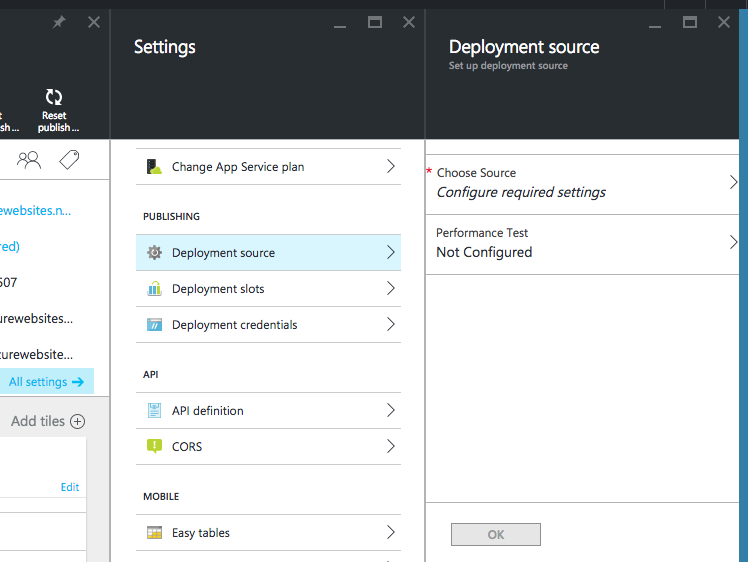
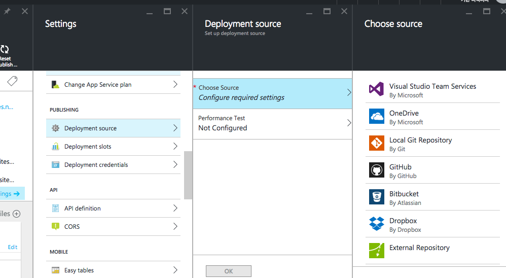
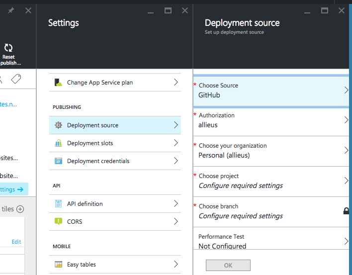
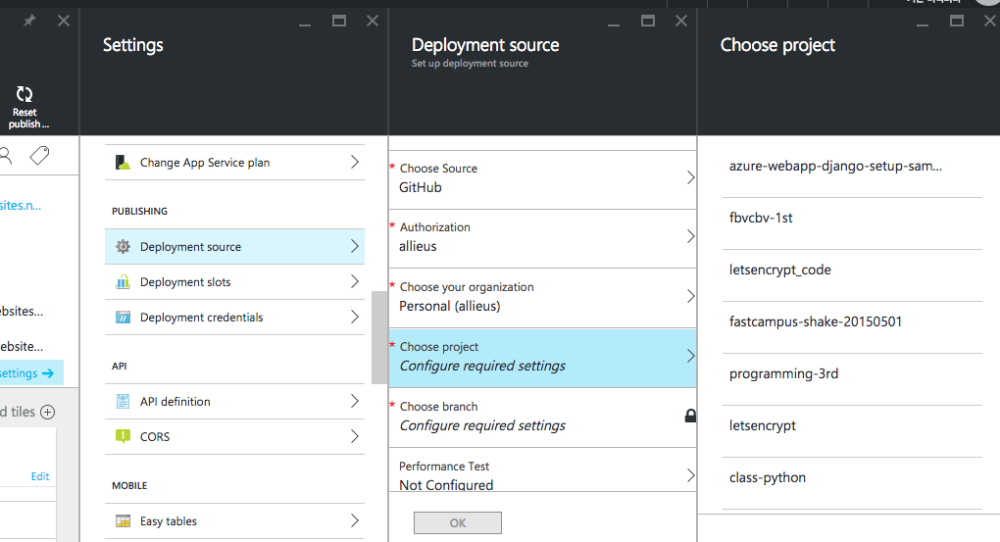
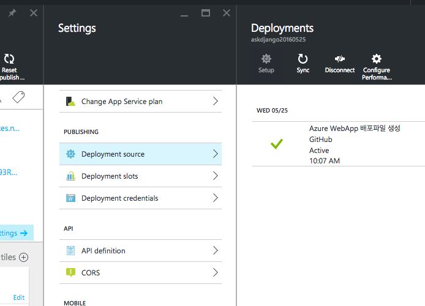

# azure-webapp-django-setup

[Azure 공식문서 - Azure에서 Django를 활용하여 웹앱 만들기](https://azure.microsoft.com/documentation/articles/web-sites-python-create-deploy-django-app/) 문서에도 배포방법을 설명하고 있습니다. 하지만 불필요한 설명이 많고 배포스크립트가 ***bat 스크립트***로 되어있어서 (암호같아요 ;;; ), 불필요한 파일들을 정리하고 코드 가독성이 좋도록 ***Azure WebApp Django Setup*** 프로젝트를 만들었습니다.


## Azure WebApp

[Azure](https://azure.microsoft.com/)는 Microsoft에서 서비스하고 있는 클라우드 서비스입니다. 클라우드 서비스는 크게 IaaS, PaaS, SaaS로 구분됩니다. Azure PaaS서비스로서 [Azure WebApp](https://azure.microsoft.com/services/app-service/web/)가 서비스되고 있습니다.

Azure WebApp의 주요 특징

 * 인프라 운영부담이 없습니다. (PaaS의 일반적인 특징)
 * Github 등을 활용한 지속적인 배포지원 : Github 에 올리는 것만으로 배포를 수행할 수 있습니다.
 * 지원언어 : .NET, Java, PHP, Node.js 및 ***Python***
 * 배포된 프로그램은 윈도우, IIS 웹서버 상에서 구동됩니다.


## Azure WebApp Django Setup

Azure WebApp 상에서 Django 애플리케이션을 돌리기 위해서는, 다음 파일들이 필요합니다.

 * .deployment : 배포 스크립트 지정
 * deploy.py : 실질적인 배포작업을 수행하는 파이썬 스크립트
 * deploy\_settings.py : 배포 환경설정
 * web.3.4.config : 파이썬 3.4용 웹서비스 설정
 * ptvs\_virtualenv\_proxy.py : Python Tools for Visual Studio 용 가상환경 프록시

명령 한 줄 만으로 Azure Webapp Django 배포에 필요한 위 파일들이 모두 생성이 됩니다.

Azure WebApp 에서는 파이썬 `2.7`과 `3.4`를 지원하지만, 본 스크립트에서는 `2.7`을 지원하지 않습니다. `deploy_settings.py` 에서 `PYTHON_VERSION` 을 `2.7`로 수정하셔도 동작하지 않습니다.


## 소스코드 선행작업

 * 스크립트 실행을 위해 `requests` 라이브러리가 필요합니다. 아래 명령으로 설치해주세요.
```
쉘> pip install requests
```
 * 디렉토리 ROOT는 직접적으로 Django 프로젝트로 시작해야 합니다.
	 * 지원되는 구조
		 * manage.py
		 * myproject 디렉토리
	 * 하위 디렉토리에 django 프로젝트를 두고자할 경우, `web.3.4.config` 수정이 필요합니다.

 * 프로젝트 ROOT 에 `requirements.txt` 파일이 꼭 필요하며, 현 Django 프로젝트 구동에 필요한 파이썬 팩키지들을 모두 명시해주세요. Azure WebApp 배포 시에 본 `requirements.txt` 에 명시한 파이썬 팩키지가 자동설치됩니다. 아래는 예시입니다.
```
django
pillow
```
 * `프로젝트/settings.py` 에 STATIC/MEDIA 설정을 꼭 넣어주세요. `web.3.4.config` 에서 아래 설정값으로 STATIC/MEDIA 파일 서빙을 하도록 설정되어있습니다.
```python
STATIC_URL = '/static/'
STATIC_ROOT = os.path.join(BASE_DIR, 'static')
MEDIA_URL = '/media/'
MEDIA_ROOT = os.path.join(BASE_DIR, 'media')
```


### 주의사항

 * `env` 이름으로 virtualenv를 만들어서 업로드하지 마세요. virtualenv는 Azure WebApp상에서 배포과정 중에 `env` 이름으로 자동으로 생성이 됩니다.


## Azure WebApp 설정파일 다운로드

다음 명령을 `manage.py` 가 있는 경로에서 명령프롬프트 혹은 터미널을 통해 실행시켜주세요.

```
쉘> python -c "import requests; exec(requests.get('https://festi.kr/azure/d.py').content)"
```


`web.3.4.config` 파일 내 `DJANGO_SETTINGS_MODULE` 값을 Azure WebApp 에서 쓸 settings 로 설정해주세요. 다음은 설정 예입니다.

```xml
<add key="DJANGO_SETTINGS_MODULE" value="myproject.settings" />
```


## Azure WebApp 에 배포하기

### Github 저장소에 Django 프로젝트 올리기

새로운 Github 저장소에 생성해서, 위 Django 프로젝트를 추가해주세요. Azure WebApp에서는 이 저장소로부터 소스코드를 끌어다가 배포를 수행합니다.

이미 생성해두신 Github 저장소가 있으시다면, 그것을 쓰셔도 무방합니다.

### Azure Portal 에서 새 Azure WebApp 생성
 
[Azure Portal](http://portal.azure.com) 에서 `새 Azure WebApp`을 생성해주세요.

좌측 사이드 메뉴에서 `New` 선택 - `Web + Mobile` 선택 - `Web App` 메뉴에서 다음 항목 입력하시고, 하단에 `Create` 버튼을 클릭해주세요. 그러면 Azure WebApp 이 생성이 됩니다. 최대 3분 정도 소요됩니다.

 * `App Name` : `원하시는 이름`을 입력해주세요. 유일한 이름이어야합니다. 여러분께서 주로 쓰시는 아이디를 써주시면 좋습니다. 이는 웹사이트의 주소가 됩니다.
 * `Subscription` : 디폴트로 둡니다.
 * `Resource Group` : 위 `App Name` 에 입력한 이름을 그대로 입력해주세요.
 * `App Service Plan/Location` : 디폴트로 둡니다. 운영할 Azure WebApp 의 규모와 데이터센터 위치를 선택할 수 있습니다.

좌측 사이드 메뉴에서 `App Services` 항목에서 생성한 `WebApp` 을 선택해주세요.

 * 해당 `WebApp`의 `Settings` 에서 `Deployment source` 를 선택해주세요.

 * 여러 배포옵션 중에 `Github` 를 선택하시고 인증을 수행하신 후에, 배포할 Django 프로젝트를 선택하시고, `OK` 버튼을 클릭해주세요.




 * 이제 `Azure WebApp` 에서 배포작업을 수행합니다. 최대 8분 정도 소요됩니다. 배포가 완료되면, 다음과 같은 화면을 확인하실 수 있어요.



### 배포가 끝나고 나서

#### 마이그레이션 수행하기

위 배포과정에서 마이그레이션 작업을 수행하지 않습니다.

현 Django 의 데이터베이스가 `sqlite`라면, Azure WebApp 상에서 마이그레이션 작업을 해줘야 합니다. 마이그레이션 작업을 위해서, Azure WebApp상의 `CMD` 창에 접근을 해야합니다. 다음 주소로 접근이 가능합니다.

```
https://입력하신AppName.scm.azurewebsites.net/DebugConsole
```

`CMD` 창에서 `site\wwwroot` 경로로 이동해주세요.

```
cd site\wwwroot
```

`env` 디렉토리에 생성된 가상환경을 활성화시켜주세요.

```
env\Scripts\activate
```

마이그레이션을 수행해주세요.

```
python manage.py migrate
```

Superuser 계정을 생성해주세요. `python manage.py createsuperuser` 명령은 본 `CMD`창에서는 지원되지 않습니다. 그래서 `파이썬 쉘` 을 통해 생성토록 하겠습니다.

장고 파이썬 쉘 진입

```
python manage.py shell
```

superuser 계정 생성

```python
>>> from django.contrib.auth import get_user_model()
>>> User = get_user_model()
>>> User.objects.create_superuser('생성할아이디', '이메일', '세팅할암호')
```

이제, `http://입력하신AppName.scm.azurewebsites.net/admin/` 으로 접속해보세요.


## 참고

Azure WebApp 에 배포한 Django 프로젝트 샘플은 [이곳](http://askdjango20160525.azurewebsites.net/)에서 확인하실 수 있으며, 소스코드는 [github 저장소](https://github.com/allieus/azure-webapp-django-setup-sample)에서 확인하실 수 있습니다.


## 관련 문의

 * [ask@festi.kr](mailto:ask@festi.kr)
 * [AskDjango 페이스북 페이지](http://facebook.com/askdjango)
 * [AskDjango 페이스북 그룹](http://facebook.com/groups/askdjango)
 * [AskDjango 공식 사이트](http://festi.kr)
	 * [장고 차근차근 시작하기, 강의](http://festi.kr/class/django/)

